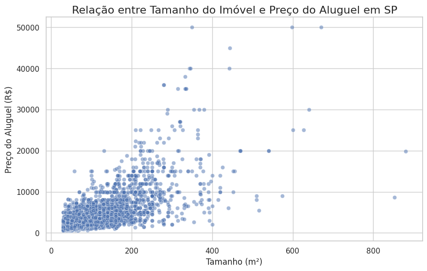
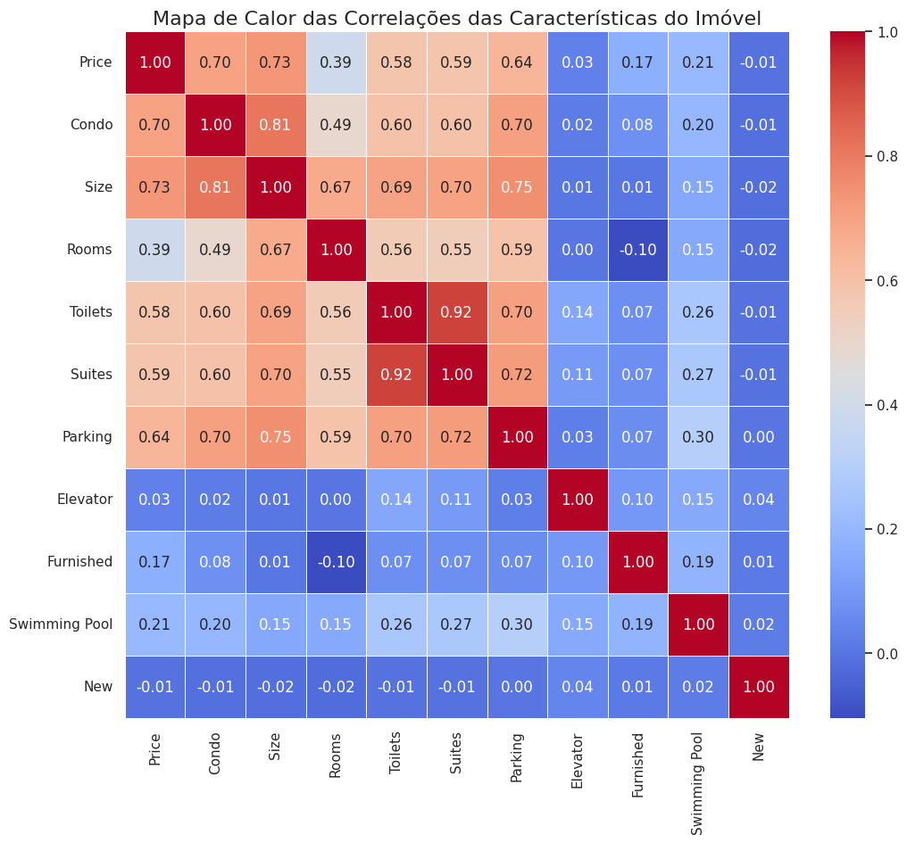
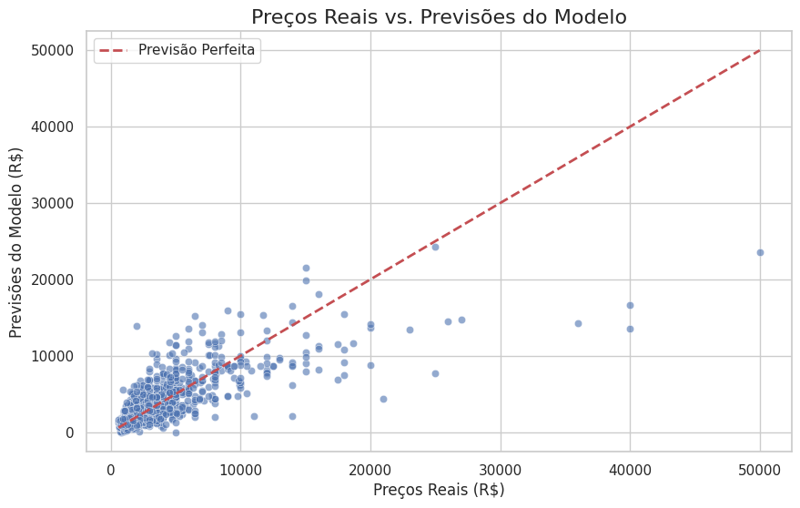

# Análise Preditiva de Preços de Aluguel em São Paulo 🏘️📈

---

## 📜 Visão Geral do Projeto

Este projeto de ciência de dados tem como objetivo construir um modelo de Machine Learning para prever o valor do aluguel de imóveis na cidade de São Paulo. Utilizando um dataset público do Kaggle, o projeto percorre todo o fluxo de trabalho de um cientista de dados, desde a limpeza e análise exploratória dos dados até o treinamento e avaliação de um modelo de Regressão Linear.

O foco principal é demonstrar o processo de investigação, tratamento de dados do mundo real, identificação de features relevantes e a avaliação crítica da performance de um modelo preditivo.

---

## 🛠️ Tecnologias Utilizadas

* **Linguagem:** Python
* **Bibliotecas Principais:**
  - **Pandas:** para manipulação e limpeza dos dados.
  - **Matplotlib & Seaborn:** para visualização de dados e geração de gráficos.
  - **Scikit-learn:** para a construção e avaliação do modelo de Machine Learning.
* **Ambiente:** Google Colab

---

## 📊 Análise Exploratória e Insights

A primeira etapa do projeto foi uma imersão nos dados para entender suas características, encontrar problemas e descobrir padrões.

### Descoberta Principal: Dados Misturados
A análise inicial com `df.describe()` revelou uma média de preço incompatível com o mercado de aluguel, indicando que o dataset continha tanto imóveis para **venda** quanto para **aluguel**. A primeira ação de limpeza foi filtrar o conjunto de dados para trabalhar apenas com os imóveis de aluguel, garantindo a coerência do modelo.

### Relação entre Tamanho e Preço
Como esperado, o gráfico de dispersão mostrou uma clara **relação positiva e linear** entre o tamanho do imóvel (`Size`) e seu preço (`Price`). Imóveis maiores tendem a ter um valor de aluguel mais elevado.

### Mapa de Calor das Correlações
Para quantificar a relação entre todas as características, foi gerado um mapa de calor. Ele confirmou que `Size` (0.73) é a variável com a maior correlação com o `Price`, seguida por `Condo` (0.70), `Parking` (0.64) e `Suites` (0.59). Estas foram as *features* selecionadas para o treinamento do modelo.

---

## 🤖 Construção do Modelo de Machine Learning

Com os dados limpos e as *features* mais relevantes selecionadas, o próximo passo foi a construção do modelo de Regressão Linear.

1.  **Seleção de Features:** Foram escolhidas as 5 colunas com maior correlação com o preço: `Size`, `Condo`, `Parking`, `Suites` e `Toilets`.
2.  **Divisão Treino-Teste:** O conjunto de dados foi dividido em 80% para treinamento e 20% para teste. Essa é uma prática fundamental para avaliar se o modelo consegue generalizar seu aprendizado para dados que nunca viu antes.
3.  **Treinamento:** Um modelo de `LinearRegression` da biblioteca Scikit-learn foi treinado utilizando os dados de treino.

---

## 🎯 Resultados e Avaliação

Após o treinamento, o modelo foi avaliado com os dados de teste. O gráfico abaixo compara os preços reais com as previsões feitas pelo modelo. O ideal é que os pontos se alinhem o máximo possível na linha diagonal vermelha, que representa a previsão perfeita.

As métricas de avaliação quantitativa foram:

| Métrica | Valor | Descrição |
| :--- | :--- | :--- |
| **Erro Absoluto Médio (MAE)** | R$ 1.242,38 | Em média, o modelo erra as previsões em aproximadamente R$ 1.242. |
| **R² (Coeficiente de Determinação)** | 0.60 | O modelo consegue explicar **60%** da variação nos preços dos aluguéis. |

---

## ✅ Conclusão

Este projeto demonstrou com sucesso o ciclo completo de uma análise de dados, resultando em um modelo de Regressão Linear funcional (baseline). Com um R² de 0.60, o modelo prova que as características selecionadas têm um forte poder preditivo, embora ainda existam 40% de variabilidade nos preços que não foram capturados, provavelmente relacionados a fatores mais complexos como a localização exata e a qualidade do imóvel.

**Próximos Passos Sugeridos:**
* **Engenharia de Features:** Tratar a coluna de bairros (`District`) para incluí-la no modelo.
* **Modelos Mais Complexos:** Testar outros algoritmos de regressão (como Random Forest ou Gradient Boosting).
* **Otimização de Hiperparâmetros:** Realizar ajustes finos no modelo para diminuir o erro.
